## Docker and NetBeans

This chapter will show you basic Docker tooling with NetBeans:

- Pull/Build Docker images
- Run/Start/Stop Docker containers

NOTE: NetBeans only supports configuring Docker Engine running using Docker Toolbox. This means that if you are running Docker for Mac or Docker for Windows then NetBeans cannot be used.

## Configure Docker Host

In "`Services`" window, right-click on "`Docker`", click on "`Add Docker...`"

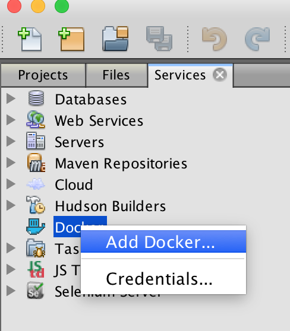

Specify Docker Machine coordinates, click on "`Test Connection`" to validate the connection:

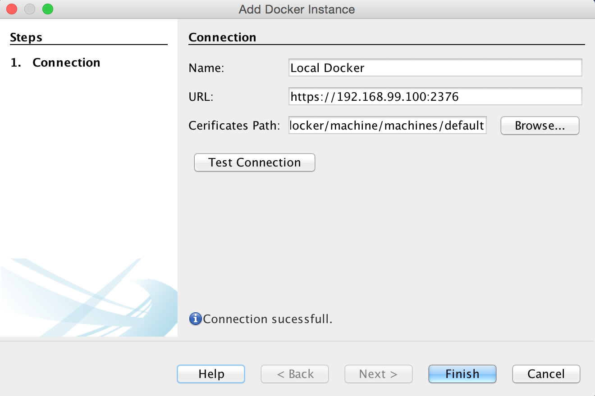

NOTE: No support for Docker for Mac/Windows, filed as https://netbeans.org/bugzilla/show_bug.cgi?id=262398[#262398].

Click on "`Finish`" to see:

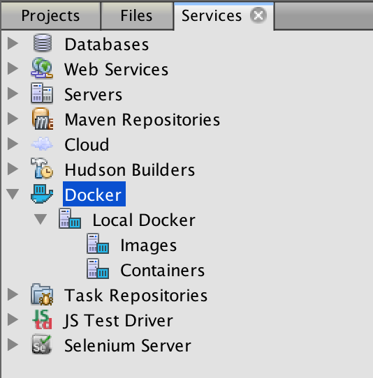

Expand the connection to see "`Images`" and "`Containers`".

## Pull an Image

Right-click on Docker node and select "`Pull...`".

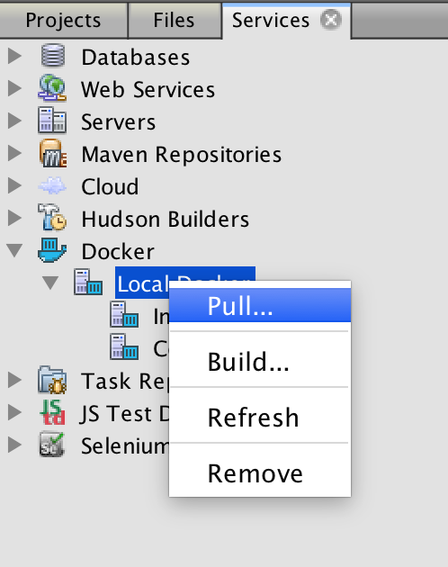

Type the image name to narrow down the search from Docker Store:

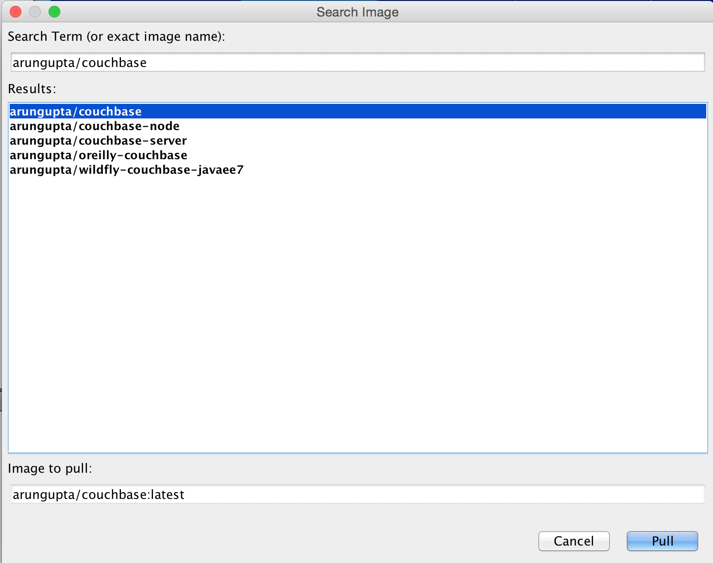

Click on "`Pull`" to pull the image.

Log is updated in the Output window:

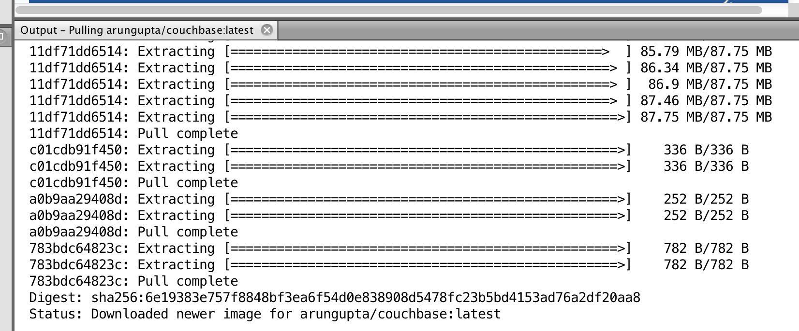

This image is now shown in Services tab

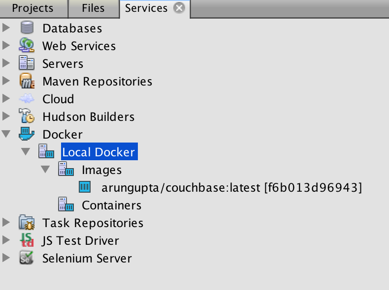

Any existing images on the Docker Host will be shown here as well.

## Run a Container

Select an image, right-click on it, and click on "`Run...`".

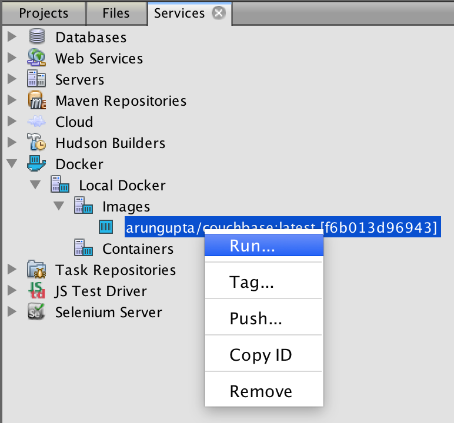

This brings up a dialog that allows the options that can be configured for running the container. Some of them are:

- Container name
- Override the command
- Keep STDIN open and allocate pseudo-TTY (`-it` on CLI)
- Publish ports on Docker host interface (`-P` or `-p` in `docker run` command)

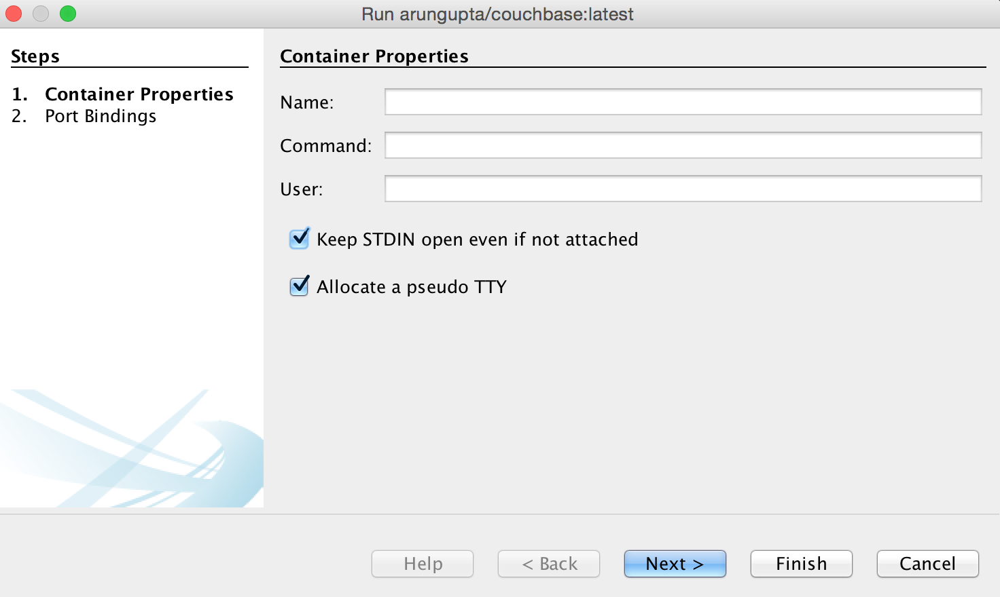

Click on "`Next>`" to see the options to configure exposed ports. Click on "`Add`" to explicitly map host port "`8091`" to container port "`8091`".

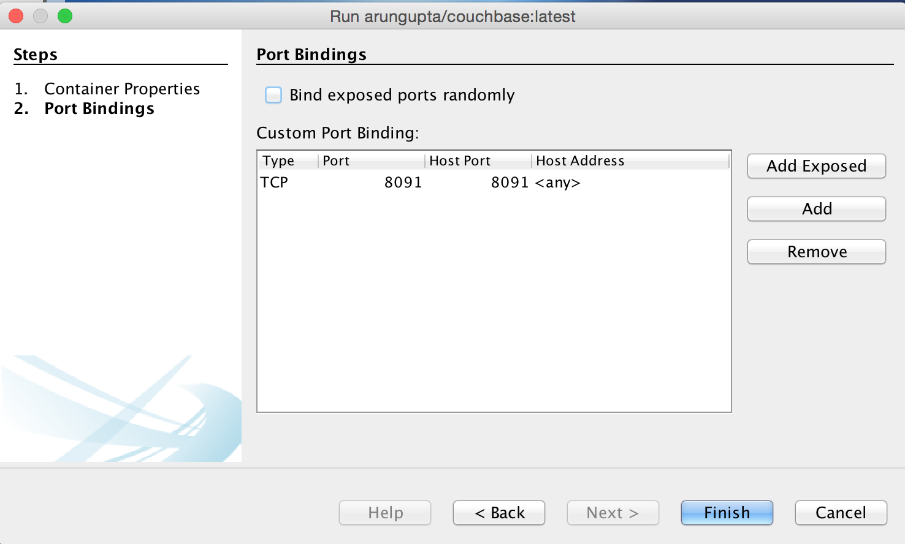

Click on "`Finish`" to run the container. "`Services`" window is updated as:

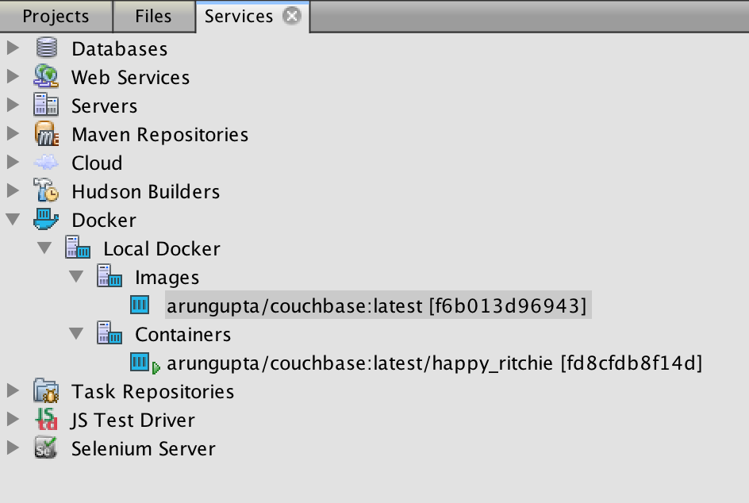

Log is shown in the "`Output`" window:

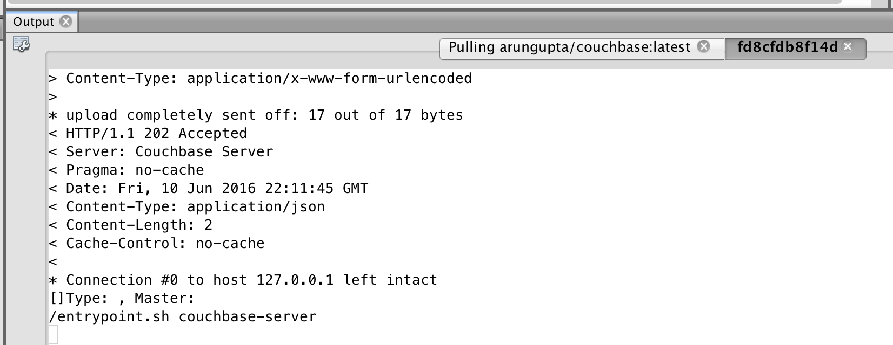

Right-click on the container, select "`Show Log`" to show the log generated by the container. The container can be paused and stopped from here as well.

## Build an Image

On the configured Docker Host, right-click and select "`Build...`" to build a new image:

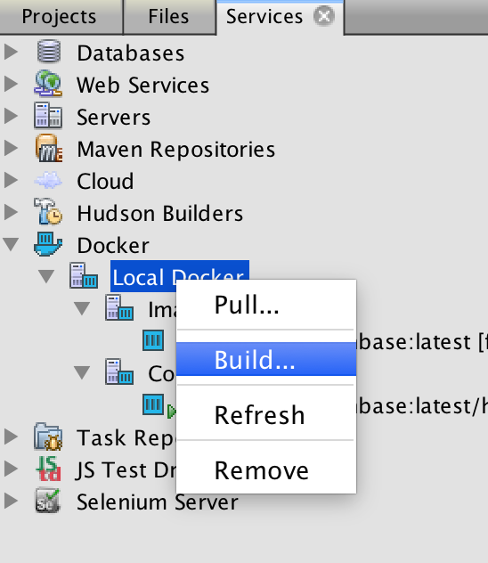

Specify a directory where `Dockerfile` exists, give the image name:

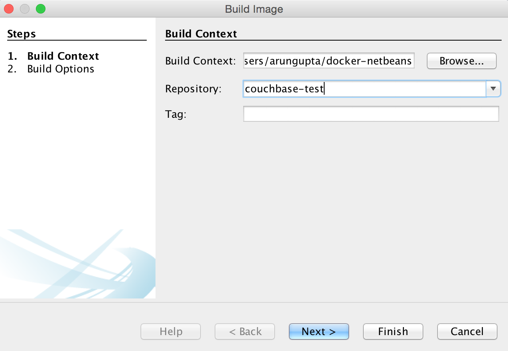

Click on "`Next>`", choose the options that matter:

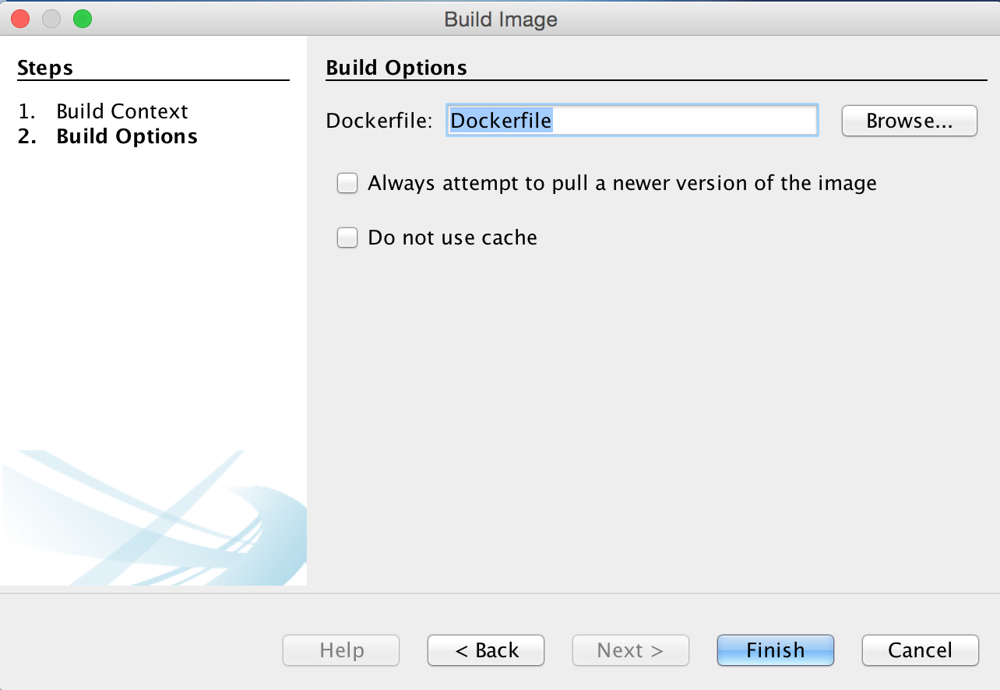

Click on "`Finish`" to build the image. The image is shown in the "`Services`" window:

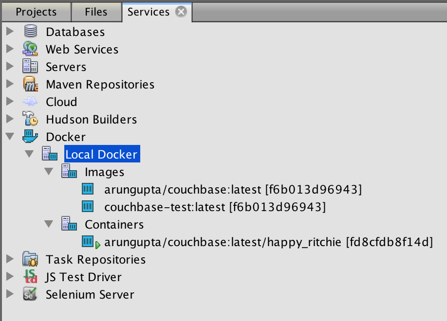

